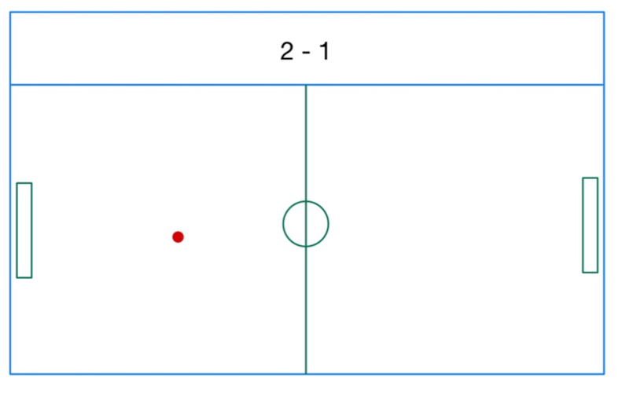
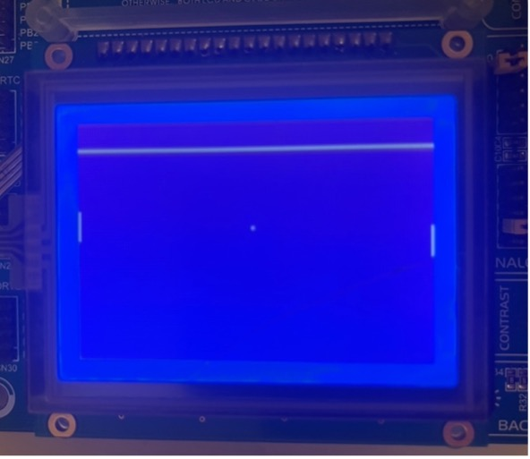
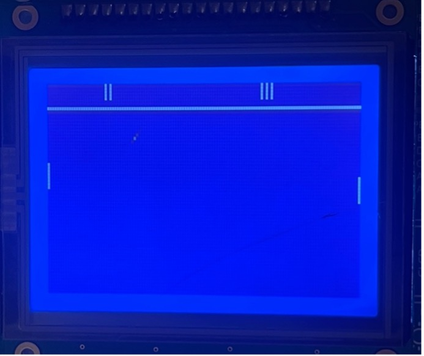

# Pong-Game-Project-Embedded-Systems

- This is a course project I did for the Embedded Systems course, COMP/ELEC 317.
- It is the well-known Pong Game implemented with an AVR Board using assembly.
- The code for the game was completely written in assembly language and is contained in main.asm (around 850 instructions, over 1000 lines with comments and define directives)
- This code runs on the AVR Board.
- There is also ser.py, which is a python code that can be run on a connected computer to play the game against a computer.
- It contains usage of UART, GLCD, EEPROM, and Watchdog Timer.
- Below is my report on it with illustrations, you can also check out the video demo.mov

## Introduction
In the final project for the course Embedded Systems (COMP/ELEC 317) I made the well-known Pong Game in AVR. This game utilizes GLCD screen, EEPROM, Watchdog Timer, and UART communication. The code for this game was written in Assembly. Only the ‘ai’ (AI is used throughout this project to mean a computer program that user plays against, it does not refer to any learning function such as neural network) part utilizes python code run on the computer connected with UART, however that is only a simple program that reads current game information from UART and sends a decision Up or Down if needed to the main program via UART. Since the game completely runs on the AVR board, no UART connection is needed for two-player mode.

### Figure 1:Initial planned game screen

### Figure 2: Initial game screen

### Figure 3: Game screen with score 2-3

# Program

## Overview
The game starts with previously game speed selected and waits until user presses start (pin B4) button. User can select game speed from three options: fast, medium, slow using pins B5-7 before pressing start. The previous game’s speed will be selected as default (it is stored in persistent [EEPROM] memory). After start is pressed game starts user(s) can press buttons A0-1 and A6-7 to move their sliders up-down. Ball collides with walls and sliders; this causes it to change directions. If a goal is scored, score is updated and displayed on the top (somewhat different than initially planned in figure 1) and the ball and sliders are reset to initial positions. If the ‘ai’ code in the computer is connected via UART, player 2 (right) will receive directions from the computer. The user can press pins D2 and D3 at the same time to pause the game. Pausing activated Watchdog Timer and pause of more than 2 seconds will reset the game. Pressing D2 resumes the game. There is a better (error-proof) way to pause with this code. We can hold D3 and then press and lift D2, then lift D3.

## Program Flow
Program begins by initializing the screen and waits for user to select speed of game and to press start. After start is pressed game enters the main loop. In the main loop overall work is divided into tasks as we learned to do in the course. The tasks are checking for pause, getting user 1’s input, getting user 2’s input, communicating with computer for ai, updating game task, also followed by a short delay.

## Tasks
Getting input from user 1 and 2 is for checking if user pressed a button for up/down of any two sliders. One press before an update is enough to register the next move. It does not update slider positions, it only registers what user chooses to do in the next move.
Communication with computer is the task for sending the updated game information (ball ‘s y coordinate and slider positions) to the computer only once after each update and checking if computer send its move choice.

Pausing the game task checks if user pressed pause. If so, it will start a watchdog timer. If 2 seconds pass, game resets.

The main action is done in the updating game task: Once game state is the state to update, it does the following actions in sequence:
-	Remove Sliders (from screen)
-	Remove Ball (from screen)
-	Update positions of ball and sliders
-	Check for collisions of ball with sliders, walls, or goal nets: This subroutine also initializes the game to start if goal occurs and displays the score.
-	Place the ball (to the screen)
-	Place the sliders (to the screen)

The first two and last two subroutines only update the screen, whereas the middle two update the game directly and do not have anything to do with the screen.
